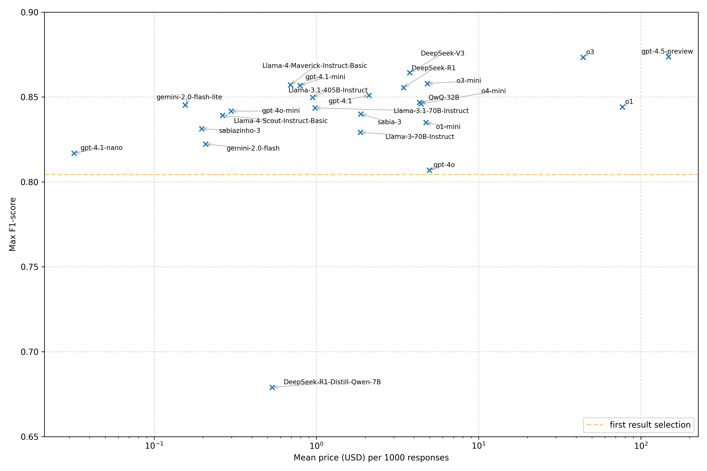

# Large Language Models as Medical Codes Selectors: a benchmark using the International Classification of Primary Care

[](https://doi.org/10.5281/zenodo.15998991)



This repository contains the data and code for the study "Large Language Models as Medical Codes Selectors: a benchmark using the International Classification of Primary Care" published as preprint at arXiv and currently under peer review. The full article is available here.

## Reproducing the study results

This study was performed in several steps and builds upon Almeida et al. work on [ICPC-2 search engines](https://jmai.amegroups.org/article/view/9766/html).

- **Setup virtual environment**:
Setup a virtual environment with Python 3.11 or greater and install the requirements from `requirements.txt`.

- **Vector database**:
Since the setup of the vector database can take several hours and may have some cost due to API services, a compressed file vector_database.zip with the vector database is available for download in this [link](https://drive.google.com/file/d/1vwnhH56KZssGCp2MVV0m0iTEQ2gYTHuy/view?usp=sharing). All you need to do is download the file and extract its contents at the root directory of this repository.

- **OpenAI embedding model**: 
To perform the retrieval steps you will need an [OpenAI](https://platform.openai.com/) API key and define it in the `.env` file. 

- **Prepare the vector database and the evaluation dataset**: 
Run the following to prepare the vector database and retrieve the results for each query in the evaluation dataset. This command will build the vector database if it is not available at the root directory. If that is the case, it may take some time to complete and may cost you credits at OpenAI.
    You can start setup the virtual environment and run:
    ```
    python prepare.py
    ```
    or simply use `uv run`:
    ```
    uv run prepare.py
    ```

- **Perform automatic code selection with the selected LLMs**:
Run the following to perform inference with all the selected LLMs. The results of this scripts are already provided in the file `data/llms_results.csv` to avoid additional costs. If you're interested in reproducing this yourself, run:
    ```
    python get_llms_results.py
    ```
    or
    ```
    uv run get_llms_results.py
    ```

- **Evaluation**:
Run the following to compute the evaluation metrics and create the LaTeX tables. All files will be stored in the `results` folder.
    ```
    python eval.py
    ```
    or simply use `uv run`:
    ```
    uv run eval.py
    ```

- **Plots**:
Run the following to plot the graphs. 
    ```
    python plot.py
    ```
    or simply use `uv run`:
    ```
    uv run plot.py
    ```